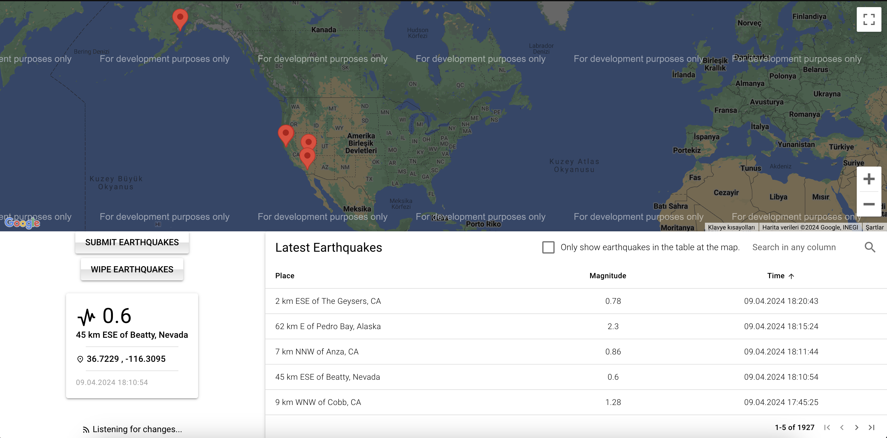
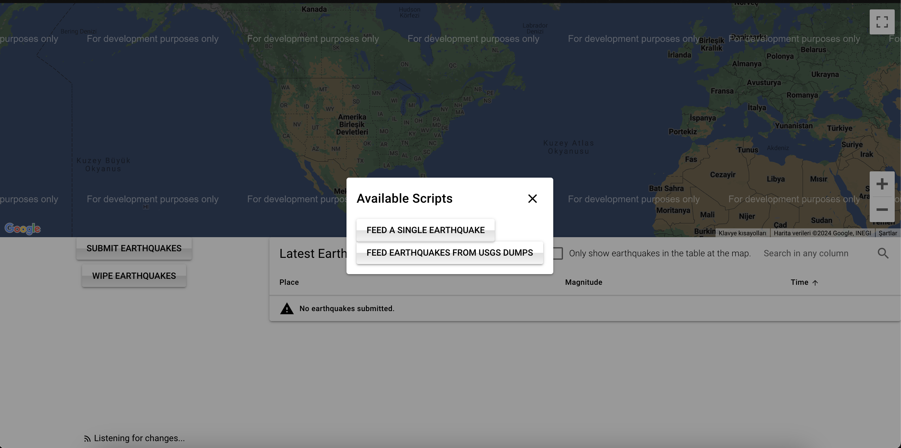

# Pillars

this was a case study for kartaca. they trashed my work for a disclosed and ungiven reason, after making me wait for a whole month. making this public, maybe someone in the future may understand the time I spent here.

- [Pillars](#pillars)
  - [Disclaimer](#disclaimer)
  - [Installation](#installation)
  - [Pitfalls](#pitfalls)
  - [Demos, Explanations, and Screenshots](#demos-explanations-and-screenshots)
  - [Why?](#why)
    - [Why MongoDB?](#why-mongodb)
    - [Why website refreshes itself too often after starting in dev mode?](#why-website-refreshes-itself-too-often-after-starting-in-dev-mode)


## Disclaimer

You will probably see that web page is completely normal on a computer screen, but mobile page is a mess. I am sorry for that, not the best frontend developer. 

## Installation

```bash
# you might need to make the script executable
# chmod +x scripts/start.sh (optional)
bash scripts/start.sh
```

that is it. now go to `localhost:333`. 

## Pitfalls 

- You need latest or modern browsers, I am using [js-bson](https://github.com/mongodb/js-bson) library of MongoDB which requires top-level-await feature. [Check browser compability table right here](https://caniuse.com/?search=top%20level%20await).

- If you are having issues mounting the volumes, especially on OSX, you might need to create `container-data` and `keys` folders manually and add them to the `file sharing` in Docker settings.

- If you want to see the data live, you can do 

```bash
❯ docker exec mongodb mongosh
Current Mongosh Log ID:	66139dd81bff5e5777403e98
Connecting to:		mongodb://127.0.0.1:27017/?directConnection=true&serverSelectionTimeoutMS=2000&appName=mongosh+2.2.2
``` 

to get the connection string and use it in MongoDB Compass along with the user&password in the `.env` file.

## Demos, Explanations, and Screenshots

**I will not go into technical details here.**

When you first navigate to `localhost:333`, you will see our one and only page, the index:



Frontend is really really simple. Screen is divided into two. 

- Google Maps
- Info Panel
  - Wipe Earthquakes
  - Submit Earthquakes
  - Connected / Reconnect
  - Latest Earthquakes Table.

Only 6 main components. Starting from `Submit Earthquakes`,



We have two script. First, `Feed a Single Earthquake` and the second, `Feed Earthquakes from USGS Dumps`. Yes, there is no `random earthquake input in random intervals`. I cannot simulate good enough data to make our screenshots, or your viewing experience better.  

When you load the index page, a websocket connection to the backend will be created. This will be the backbone of our index/hot reload of our data. If you see the text "Listening for changes..." at the bottom left, then you are good to go.

Clicking our first dialog:

https://github.com/caner-cetin/canercetin-usg-kartaca-2024/assets/92731060/20b44dbf-1ff3-4c63-a33c-77bf98701447

As you see, after we feed the single earthquake to the system, table will get updated and a new marker will be added to the map. Mudanya, Bursa in this case. You can see the details of earthquake if you either

- click the marker
- click the corresponding row in latest earthquakes

Second dialog:


https://github.com/caner-cetin/canercetin-usg-kartaca-2024/assets/92731060/3c45462d-00dd-4490-b196-7ca4c01f68dd


In this option, you can feed a [GeoJSON dump](https://earthquake.usgs.gov/earthquakes/feed/v1.0/geojson.php) to the Mongo.

As the change stream/documents are processed, you can view the data inserted one by one. Or, you can simply refresh the page, and view everything from the dump. When you refresh the page, remaining of the batch will not be streamed to you, but streaming will continue for other users connected during bulk insert. 

Table also have a search functionality:


https://github.com/caner-cetin/canercetin-usg-kartaca-2024/assets/92731060/570ec049-5e03-48e8-ba06-aa1398cdf884


For wiping everything:


https://github.com/caner-cetin/canercetin-usg-kartaca-2024/assets/92731060/e9c5acb7-a3bc-4ade-9762-b5f50a031a8f

As I said, frontend is really simple, and probably not the nicest job you will see. I am mainly backend developer, soo. Still did my best. I hope you like it.


## Why?

### Why website refreshes itself too often after starting in dev mode?

Quasar w/ Vite does that in cold start, unfortunately. Currently, there is nothing wrong in production mode, and Dockerfile is set to the production, but dev mode force refreshes itself with no reason. See => https://github.com/quasarframework/quasar/issues/12933

